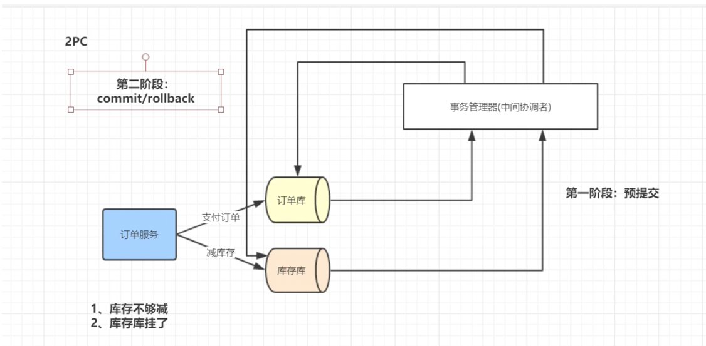

### Zookeeper的事件通知：
#### Watch
可以把Watch理解成在特定Znode节点上的条件触发器，当这个Znode发生改变时，也就是调用了`create`，`delete`,`setData`方法时，将会触发Znode上注册的事件，请求Watch的客户端会接收到异步通知。

* * *
### Zookeeper的一致性
Zookeeper Service服务是一主多从的结构。
在更新数据时，首先更新主节点的数据，再同步数据到从节点，客户端查询的时候从任意从几点获取数据。
为了保证数据的一致性，Zookeeper采用了ZAB协议。

#### 什么是ZAB协议
##### ZAB协议的三种状态
* Looking：选举状态
* Following：Follower节点（从节点）状态
* Leading：Leader节点（主节点）状态

##### 最大ZXID
最大ZXID就是本节点最新的事务编号ID

##### ZAB崩溃恢复
ZAB崩溃恢复有三个阶段
1. 选举阶段：此时集群处于Looking状态。每个节点服务器会向其他服务发送自己的服务器ID和ZXID（本服务器最新的事务ID）。
每个服务器进行比较，如果别的服务器的ZXID大于自己的ZXID则给那个大于自己的服务器投票。
每次投票后，服务器统计票数，判断是否有一个节点获取了超过半数的投票，如果某一个节点的票数超过服务器的半数，则这个服务器为Leader，其他服务器为Follower。
2. 发现阶段：用于在从节点发现最新的ZXID，Follower将最新的ZXID发送给Leader，Leader选出最新的ZXID更行自身的历史日志。
3. 同步阶段：把Leader更行的历史日志同步到Follower节点上，当半数的Follower节点都更新完毕，这个准Leader才能成为Leader，此时集群恢复完毕。

#### zookeeper分布式锁：
有一个parentLock持久节点，当第一个客户端想要获取锁，会创建一个临时有序节点Lock1，客户端会在parentLock中遍历，看创建的Lock1临时节点的顺序是否为第一位，如果是第一个，则获取锁，当第二个客户端访问时，会创建临时有序节点Lock2，Lock2的顺序不是第一位，则获取不到锁，需要等待客户端1执行完成才能获取锁继续操作。

### Dubbo有哪几种容错机制：

| **集群容错方案** | **说明** |
| --- | --- |
| Failover Cluster | 失败自动切换，自动重试其他服务器（默认） |
| Failfast Cluster | 快速失败，立即报错，只发起一次调用 |
| Failsafe Cluster | 失败安全，出现异常时，直接忽略 |
| Failback Cluster | 失败自行恢复，记录失败请求，定时重发 |
| Forking Cluster | 并行调用多个服务器，只要一个成功即返回 |
| Broadcast Cluster | 广播逐个调用所有提供者，任意一个报错则报错 |

### Dubbo有哪几种负载均衡：

### 分布式事务
大部分分布式事务底层原理都是两阶段提交协议（2PC）

### 分布式事务-微服务

#### **TCC方案（蚂蚁金服）**

