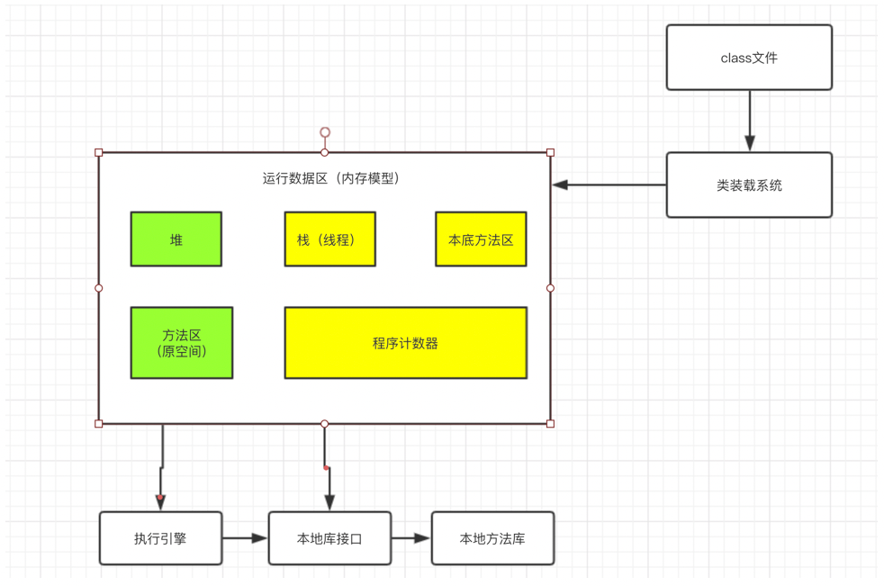
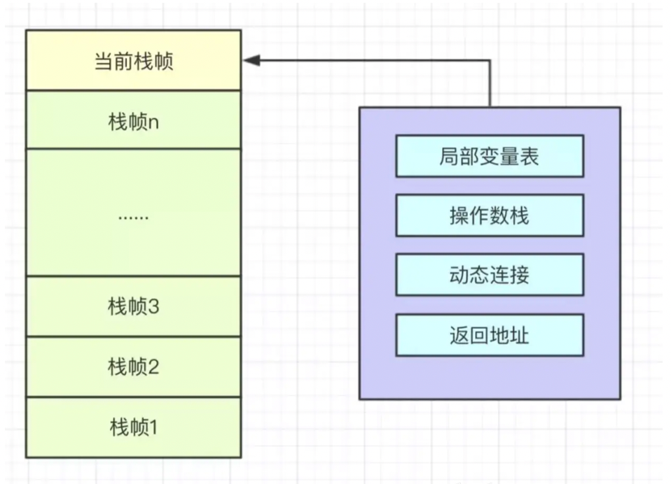

## JVM：Java虚拟机

**类加载器**：加载字节码文件到内存

**执行引擎**：对JVM指令进行解析，翻译成机器码，解析完成后提交到操作系统。

**本地库接口**：供Java调用的，融合了不同开发语言的原生库。

**本地方法库**：Java本地方法的具体实现。

**运行时数据区**：JVM核心内存空间结构模型。
运行时数据区是JVM内存结构最重要的部分。

### 运行时数据区：
1. 方法区
方法区是存储虚拟机加载的类信息、常量、静态变量，及时编译器编译后的代码等数据。方法区是一种规范，永久代是方法区的一种实现，这里有一个常考的面试题：JDK7以前的版本，字符串常量池是放在永久代中的，JDK7将字符串常量池移动到了对中，JDK8直接删除了永久代，改用原空间替代永久代。
2. 本地方法区（栈）
本地方法区（栈）与Java栈的作用和原理基本相同，都可以用来执行方法，不同点在于Java栈执行的是Java方法，本地方法栈执行的本地方法。
3. 程序计数器
程序计数器占用的内存空间较小，是当前线程所执行的字节码行号指示器，通过改变这个计数器的值来取下一条需要执行的字节码指令。多个线程之间的程序计数器相互独立，互不影响，为了保证每个线程恢复后都可以找到具体的执行位置。
4. Java堆
Java堆是用来存放实例化对象，Java堆被所有线程共享，在虚拟机启动时创建，用来存放对象实例，是Java内存结构的大头，占用大部分的空间，是GC的主要管理区域，又可分为年轻代、老年代、永久代，JDK8及以后去掉了永久代。

    - 年轻代
    年轻代又可分为Eden，from Survivor，to Survivor。
    Eden区：对象刚被创建的时候，存放在Eden区，如果Eden区放不下，则放在Survivor区，甚至老年代中。
    Survivor区：Survivor又可分为Survivor From和Survivor To，GC回收时使用，将Eden中存活的对象存入Survivor From中，下一次回收时，将Survivor From中的对象存入Survivor To中，清楚Survivor From，下一次回收时重复上次步骤，Survivor From变成Survivor To，Survivor To变成Survivor From，依次循环，同时每次回收，对象的年龄都+1，年龄增加到一定程度的对象，移动到老年代中。
    - 老年代
    存放生命周期较长的对象。JDK8之后改用原空间替代永久代。
    - 元空间
    Java8之后开始将类的元数据放在堆内存中，这块区域叫做元空间，在Java7及以前，元空间是放在永久代中的，Java8之后又分离出来了。
    元空间和永久代是方法区的实现，方法区知识一种规范，在Java7之后，原先位于方法区永久代里的字符串常量池，已被移动到了Java堆中，因为永久代的内存空间极为有限，如果频繁调用inter方法，内存无法存储这么多数据。在Java8之后将永久代完全删除，使用元空间替代了永久代。
    元空间使用的本地内存，永久代使用JVM内存，所以使用元空间的好处在于程序的内存不再受限于JVM内存，本地内存剩余多少空间，元空间就可以有多大，解决了空间不足的问题。
    
5. 虚拟机栈（存放局部变量）
Java方法执行的内存模型，Java栈中存放的是多个栈帧，每个栈帧对应一个被调用的方法，主要包括局部变量表、操作数栈、动态链接、方法返回地址（方法出口）。每一个方法的执行，JVM都会创建一个栈帧，并且将栈帧压入Java栈，方法执行完毕，该栈帧出栈。

    - 局部变量表：储存方法执行过程中的所有变量，包括方中声明的局部变量和形参、
    - 操作数栈：方法中的计算过程都是借助于操作数栈来完成，将参与计算的数据压入操作数栈。
    
    栈的具体运算方式是这样的，编译器是通过两个栈来实现的，一个是保存操作数的栈，另一个是保存运算的栈。我们从左向右遍历表达式，当遇到数字，直接压入操作数栈。当遇到运算符，先与运算符栈的栈顶元素进行比较，如果高于当前栈顶元素的优先级，直接压入，否则取出当前栈顶的运算符，同时取出操作数栈的前两个数据进行运算，并将结果压入操作数栈。再次重复上述步骤，直到当前的运算符被压入栈中，当没有新的运算符发需要入栈的时候，取出当前栈顶元素以及操作数栈的两个运算，进行运算，将结果压入操作数栈，如果方法定义时需要返回值，直接将操作数栈栈顶元素返回即可。
    - **方法返回地址**：一个方法调用结束之后要返回到调用它的地方，所以栈帧中要保持能够返回到方法调用处的地址。
    每个线程都有自己的Java栈，相互独立，可以同时执行各种的方法，每个方法的执行都是毅哥栈帧的入栈和出栈过程，Java虚拟机栈用来储存栈帧，方法调用结束之后，帧会被销毁。
    
    
### GC：在堆里面
新new的对象会放在Eden区，如果Eden区中有对象没有连接到GC Root根（可达性分析算法），就会回收掉，如果有连接到GC Root根，则触发minorGC，将对象放入Survivor区，当Survivor区中触发minorGC，如果还有对象被引用，这个对象的对象年龄就会加一，如果对象年龄为15（默认，经过了15次GC），就会将这个对象放入老年代，如果老年代中对象满了，则会触发full GC，如果老年代中的对象还有引用，触发Full GC失败，则会抛异常：内存溢出。

调优：尽量的减少Full GC的次数，尽量在年轻代将垃圾回收。
