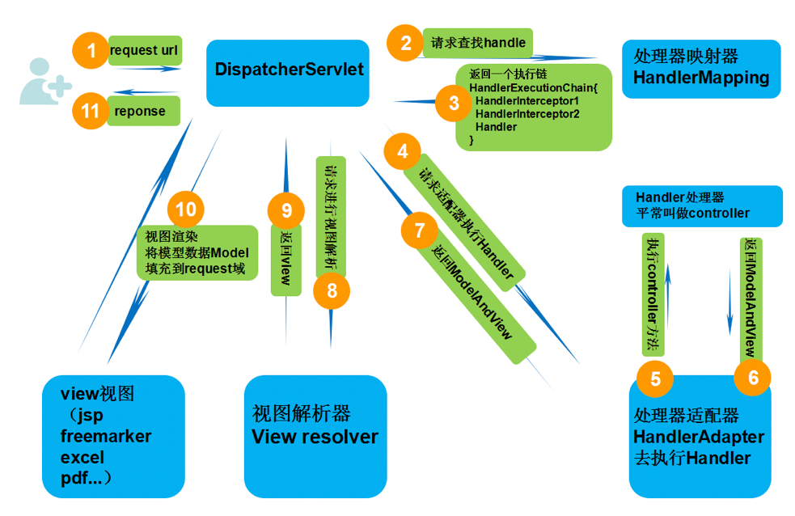

### SpringMVC工作流程：

1. 用户发送请求至前端控制器DispatcherServlet。
2. DispatcherServlet收到请求调用HandlerMapping处理器映射器。
3. 处理器映射器找到具体的处理器（可以根据xml配置、注解进行查找），生成处理器对象及处理器拦截器（如果有则生成）一并返回给DispatcherServlet.
4. DispatcherServlet调用HandlerAdapter处理器适配器。
5. HandlerAdapter经过适配器调用具体的处理器（Controller，也叫后端控制器）。
6. Controller执行完成返回ModelAndView。
7. HandlerAdapter将Controller执行结果ModelAndView返回给DispatcherServlet。
8. DispatcherServlet将ModelAndView传送给ViewReslover视图解析器。
9. ViewReslover解析后返回具体的View，这个View不是完整的，仅仅是一个页面（视图）名字，且没有后缀。
10. DispatcherServlet根据View进行渲染视图（即将模型数据填充至视图中）。
11. DispatcherServlet响应用户。

图中可以看到，DispatcherServlet（前端控制器）占据了很大的一部分，事实也是如此，SpringMVC中，DispatcherServlet是他的核心。